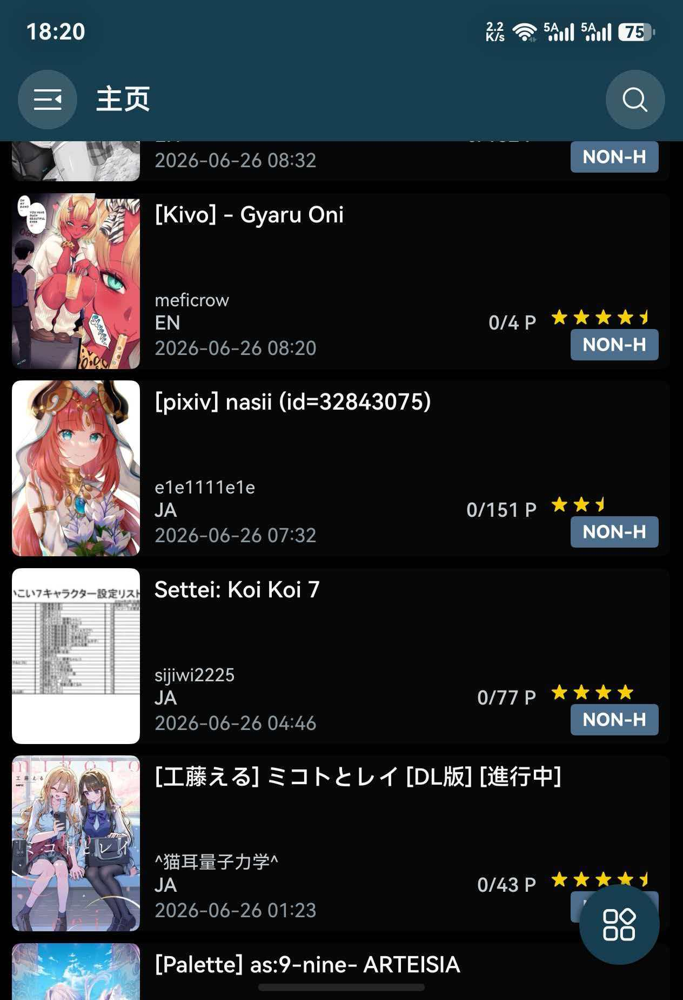
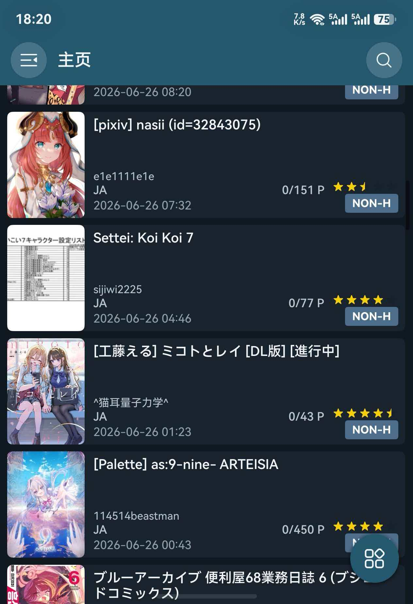
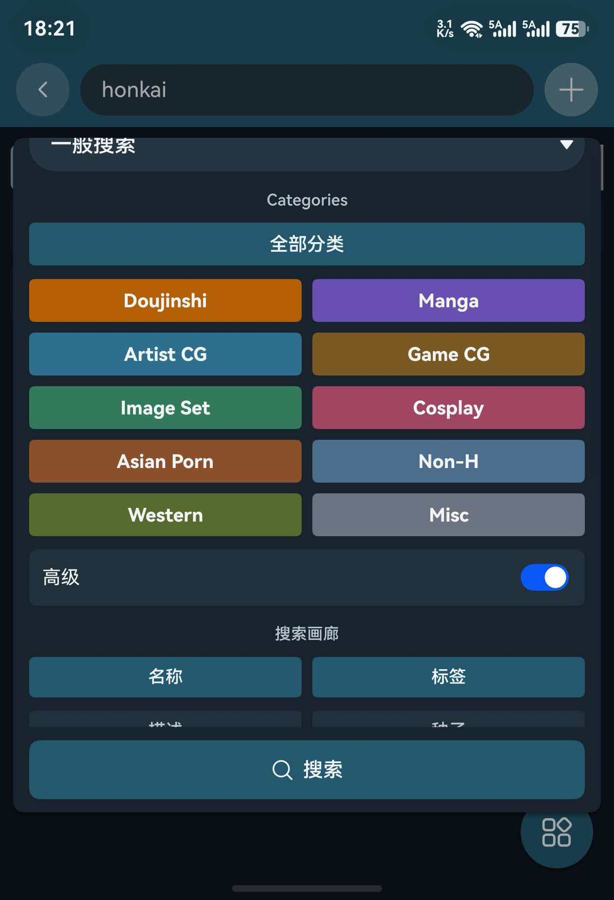
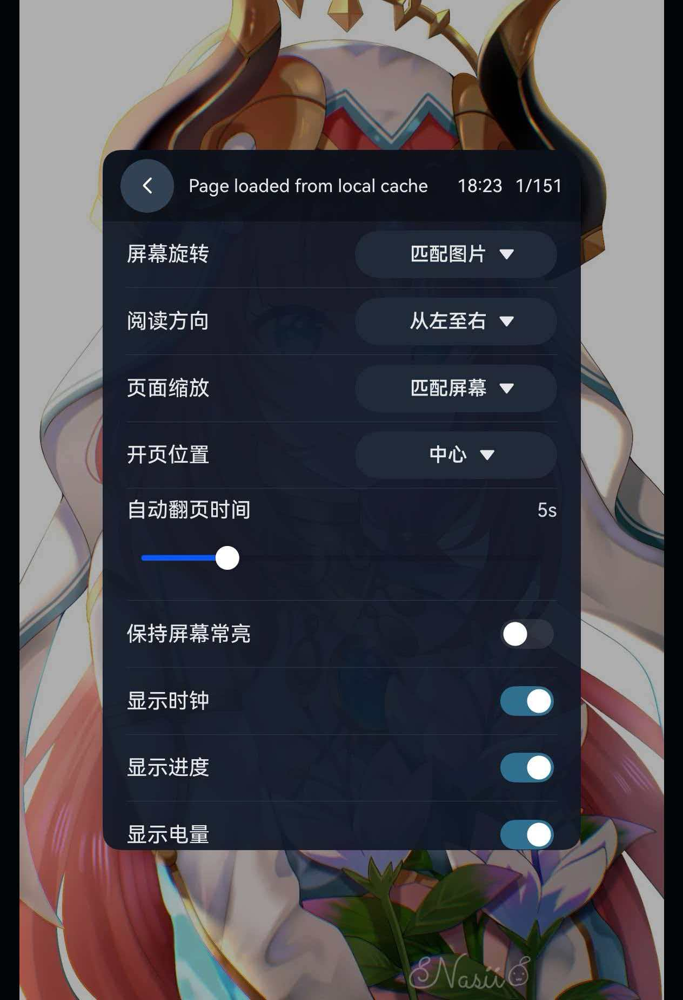

# EhViewer HarmonyOS

  

这是 [Ehviewer_CN_SXJ](https://github.com/xiaojieonly/Ehviewer_CN_SXJ) 的 HarmonyOS 移植版本，目标是在鸿蒙设备上使用接近原应用的浏览、搜索、阅读、下载和设置体验。目前版本仍在快速迭代中（烧token如流水），请各位多多反馈意见和建议，多提bug，我会尽快完善（token没烧完的话）。

## 界面预览

<table>
  <tr>
    <td></td>
    <td></td>
    <td></td>
  </tr>
  <tr>
    <td align="center">黑色主题主页</td>
    <td align="center">深色主题主页</td>
    <td align="center">画廊列表</td>
  </tr>
  <tr>
    <td></td>
    <td></td>
    <td></td>
  </tr>
  <tr>
    <td align="center">画廊详情</td>
    <td align="center">标签搜索</td>
    <td align="center">高级搜索</td>
  </tr>
  <tr>
    <td></td>
  </tr>
  <tr>
    <td align="center">阅读器设置</td>
  </tr>
</table>

## 下载及安装

请在 [GitHub Releases](https://github.com/suibianqwe/Ehviewer_OHOS/releases) 中下载最新的 `.hap` 安装包。  
推荐使用 [小白调试助手](https://github.com/likuai2010/auto-installer) 安装。

当前版本：`0.3.60`  
目标API：`6.1.1(24)`  
兼容API：`6.1.0.31(23)`  
**因为绕过sni功能仅能在API23实现，因此暂不支持更低API版本**（由于技术原因，仅支持里站直连）

## 功能

### 浏览

- 支持 E-Hentai 和 ExHentai。
- 支持首页、订阅、热门、排行榜、收藏、历史、下载和设置页面。
- 支持侧边菜单快速切换页面。
- 支持画廊列表刷新、翻页、加载更多和返回上次位置。
- 支持详情、缩略图、扩展等列表显示方式。
- 支持浅色、深色和黑色主题。

### 搜索

- 支持关键词搜索。
- 支持分类筛选。
- 支持高级搜索选项。
- 支持标签搜索、上传者搜索和详情页标签跳转搜索。
- 支持搜索历史保存。
- 支持开启或关闭账号过滤。

### 详情页

- 显示标题、副标题、分类、页数、上传者、评分、时间、语言、标签等信息。
- 支持查看预览图。
- 支持查看评论和全部评论。
- 支持收藏、取消收藏和评分。
- 支持复制画廊链接。
- 支持从详情页直接阅读或下载。

### 阅读器

- 支持内嵌阅读器和独立阅读器。
- 支持从左到右、从右到左、从上到下阅读。
- 支持适合屏幕、适合宽度、适合高度、实际尺寸和固定比例。
- 支持单指拖动、双指缩放、双击缩放和惯性移动。
- 支持竖向连续阅读。
- 支持音量键翻页。
- 支持底部进度条和拖动页码提示。
- 支持左上角显示时间、页码进度和电量。
- 支持自定义亮度、超暗模式和保持屏幕常亮。
- 支持长按图片刷新、分享、保存到图库或保存到指定位置。

### 下载

- 支持添加、暂停、继续和删除下载任务。
- 支持多任务下载。
- 支持查看下载进度、速度和状态。
- 支持按状态、分类和关键词筛选下载内容。
- 支持已下载漫画本地阅读。
- 支持恢复本地已有下载。
- 支持导出选中下载为压缩包。

### 历史与收藏

- 自动记录阅读历史。
- 支持保存已读页数。
- 支持打开、删除和清空历史记录。
- 支持云端收藏操作。

### 账号与网络

- 支持账号登录。
- 支持 Cookie 导入和管理。
- 支持 WebView 登录同步 Cookie。
- 支持游客模式。
- 支持系统代理、自定义代理和关闭代理。
- 支持 Hosts、DNS over HTTPS 和 SNI 前置。
- 支持网络诊断。

### 设置

- 支持 EH、阅读、下载、隐私、高级和关于等设置页面。
- 支持 UConfig 和 My Tags。
- 支持过滤规则和黑名单。
- 支持语言、主题、启动页和列表样式设置。
- 支持数据导入、数据导出、日志保存和日志导出。
- 支持防截屏和应用恢复时验证身份。

## 反馈

如果遇到问题，欢迎提交 Issue。请尽量说明：

- 出问题的页面。
- 使用的是 E-Hentai 还是 ExHentai。
- 具体操作步骤。
- 相关截图、录屏或日志。

## 致谢

感谢 [Ehviewer_CN_SXJ](https://github.com/xiaojieonly/Ehviewer_CN_SXJ) 和 [EhViewer](https://github.com/seven332/EhViewer) 项目的作者和贡献者。

感谢 [EhTagTranslation/Database](https://github.com/EhTagTranslation/Database) 项目维护中文标签翻译数据。
