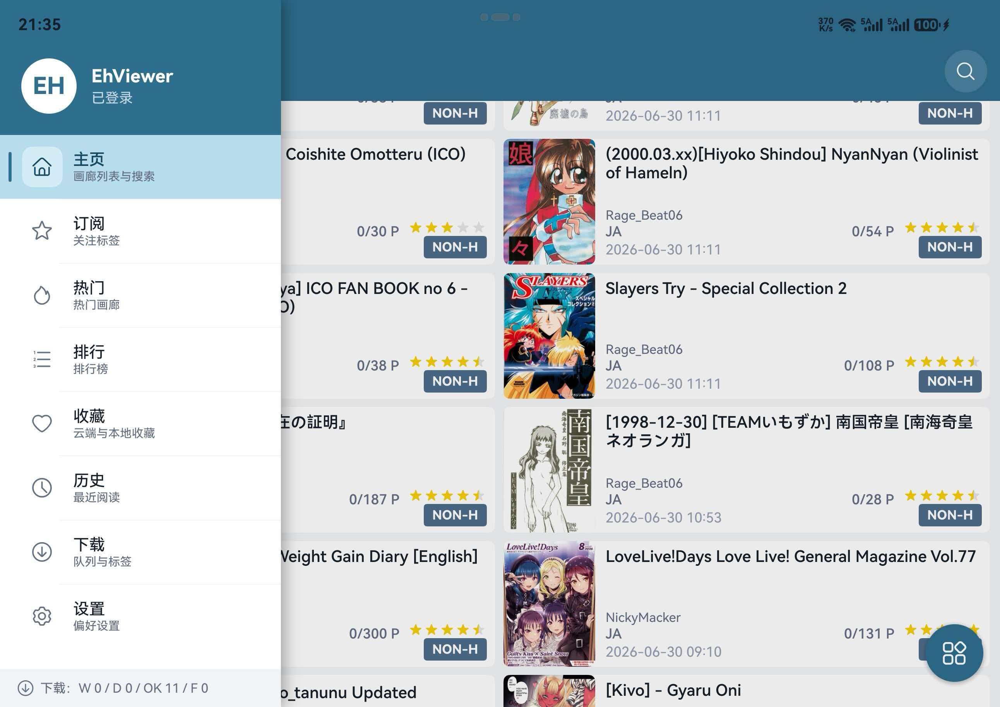
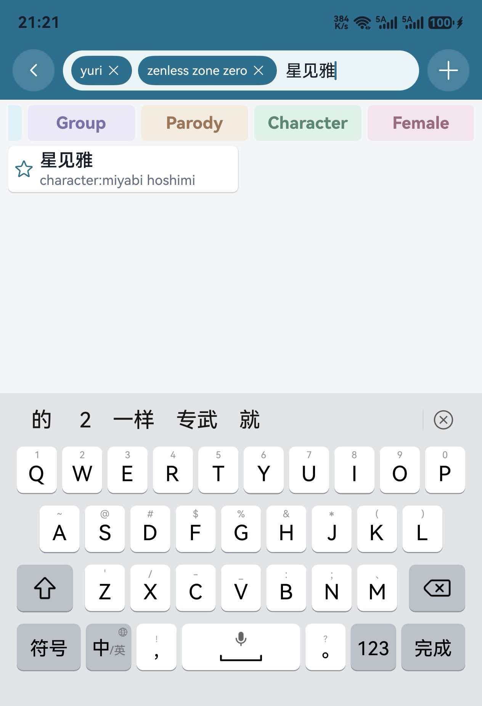
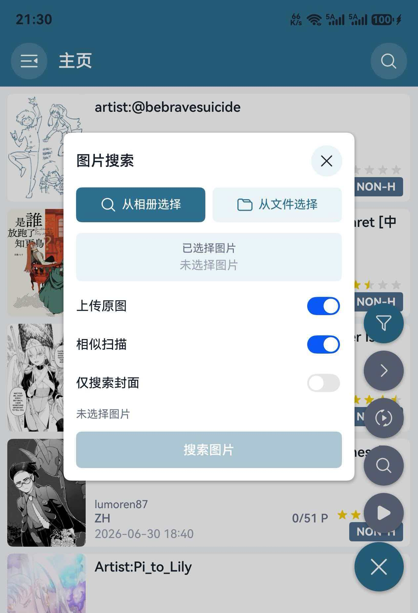

# EhViewer HarmonyOS

  

这是 [Ehviewer_CN_SXJ](https://github.com/xiaojieonly/Ehviewer_CN_SXJ) 的 HarmonyOS 移植版本，目标是在鸿蒙设备上使用接近原应用的浏览、搜索、阅读、下载和设置体验。目前仍在快速迭代中，欢迎通过 Issue 反馈问题、日志和复现步骤，也欢迎提新功能需求。

## 界面预览

<table>
  <tr>
    <td></td>
    <td></td>
    <td></td>
    <td></td>
  </tr>
  <tr>
    <td align="center">黑色主题主页</td>
    <td align="center">深色主题主页</td>
    <td align="center">画廊列表</td>
    <td align="center">侧边菜单</td>
  </tr>
  <tr>
    <td></td>
    <td></td>
    <td></td>
    <td></td>
  </tr>
  <tr>
    <td align="center">多标签搜索</td>
    <td align="center">图片搜索</td>
    <td align="center">画廊详情操作</td>
    <td align="center">高级搜索</td>
  </tr>
  <tr>
    <td></td>
  </tr>
  <tr>
    <td align="center">阅读器设置</td>
  </tr>
</table>

## 下载及安装

请在 [GitHub Releases](https://github.com/suibianqwe/Ehviewer_OHOS/releases) 中下载最新的 `.hap` 安装包。  
推荐使用 [小白调试助手](https://github.com/likuai2010/auto-installer) 安装。

当前版本：`0.4.2`

最新安装包：[`EhViewer_OHOS_0.4.2.hap`](https://github.com/suibianqwe/Ehviewer_OHOS/releases/download/v0.4.2/EhViewer_OHOS_0.4.2.hap)
发布包类型：未签名 HAP  
目标API：`6.1.1(24)`  
兼容API：`6.1.0.31(23)`  
**因为绕过sni功能仅能在API23实现，因此暂不支持更低API版本**

## 功能特色

- 浏览：支持 E-Hentai/ExHentai、首页、订阅、热门、排行、收藏、历史和下载列表。
- 搜索：支持关键词、多标签、上传者、高级筛选、搜索历史和图片相似/封面搜索。
- 详情：统一详情页逻辑，支持预览图、评论、收藏、评分、Torrent、归档、H@H、相似画廊和封面搜索。
- 阅读：支持内嵌/独立阅读器、连续阅读、缩放、方向适配、进度控制和本地下载优先读取。
- 下载：支持任务暂停/继续/删除、多线程下载、本地阅读、恢复本地下载和导出压缩包。
- 设置：支持主题、语言、启动页、过滤规则、代理/Hosts/域名前置、隐私防护和身份验证。

## 0.4.2 重点变化

- 详情页缩略图支持跳到指定缩略图页后重新加载列表，并修复追加预览图尺寸不一致问题。
- 评论区支持分数、投票、文本复制和链接识别，本站漫画链接可进入下级详情页。
- 搜索模式改为并排单选按钮，上传者和标签搜索支持完整高级搜索参数。
- 优化高级搜索浮窗位置、关闭方式和展开/收起动画。
- 阅读器图片加载失败时可点击失败图标重新加载。
- 修复阅读器退出后的状态栏颜色、沉浸布局、方向恢复和旋转锁定相关问题。
- 修复搜索结果页、评论页旋转后返回上级的问题。
- 修复下载页卡片长按多选失效和下载页详情缩略图布局异常。
- 优化大图、动图下载超时策略。

## 0.4.1 重点变化

- 图片搜索支持原图上传，修复图片搜索重定向和详情页封面搜索图片来源问题。
- 优化图片搜索浮层位置。
- 画廊卡片长按菜单新增分享、下载等快捷操作，历史页支持删除历史。
- 修复多标签搜索关键词拼接、输入栏布局和软键盘退格删除标签。
- 修复详情页相似画廊、封面搜索范围，打开搜索后保留详情页。
- 统一阅读器图片长按菜单配色。
- 改进阅读器退出时的状态栏、方向和旋转锁定恢复逻辑。
- 修复分辨率变化时搜索页、排行页、下载详情页和设置子页层级丢失。

## 0.4.0 重点变化

- 同步应用内版本号、包版本和 README 到 `0.4.0`。
- 详情页逻辑统一，下载页、排行页等入口打开的详情页复用同一套加载、阅读、下载和标签跳转逻辑。
- 完善漫画详情页的档案、H@H、相似画廊、搜索封面和 torrent 相关入口。
- 搜索页支持多标签搜索，点击标签后会在搜索栏中生成可移除标签。
- 新增图片搜索入口，可从相册或文件选择图片，并选择相似搜索或封面搜索。
- 优化排行页标签跳转，非 Gallery Toplist 的标签按上传者模式搜索，搜索范围固定为全站。
- 优化阅读器旋转和退出沉浸模式后的系统栏恢复逻辑。
- 完善隐私设置、身份验证、防截屏和语言相关文案。

## 反馈

如果遇到问题，欢迎提交 Issue。请尽量说明：

- 出问题的页面。
- 具体操作步骤。
- 相关截图、录屏或日志。

## 致谢

感谢 [Ehviewer_CN_SXJ](https://github.com/xiaojieonly/Ehviewer_CN_SXJ) 和 [EhViewer](https://github.com/seven332/EhViewer) 项目的作者和贡献者。

感谢 [EhTagTranslation/Database](https://github.com/EhTagTranslation/Database) 项目维护中文标签翻译数据。
