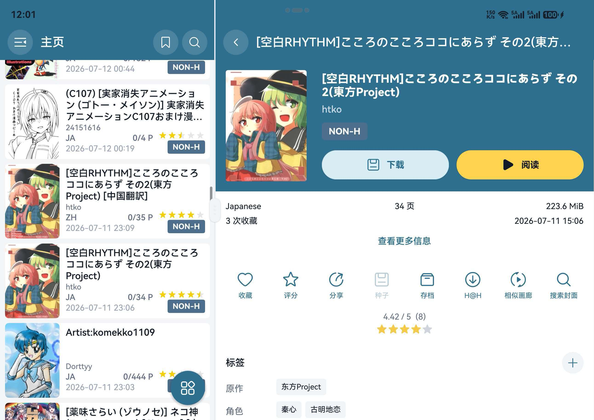

# EhViewer HarmonyOS

  

这是 [Ehviewer_CN_SXJ](https://github.com/xiaojieonly/Ehviewer_CN_SXJ) 的 HarmonyOS 移植版本，目标是在鸿蒙设备上提供接近原应用的浏览、搜索、阅读、下载和设置体验。欢迎通过 Issue 反馈问题、日志和复现步骤，也欢迎提出新功能需求。

## 界面预览

<table>
  <tr>
    <td></td>
    <td></td>
    <td></td>
    <td></td>
  </tr>
  <tr>
    <td align="center">黑色主题主页</td>
    <td align="center">深色主题主页</td>
    <td align="center">画廊列表</td>
    <td align="center">侧边菜单</td>
  </tr>
  <tr>
    <td></td>
    <td></td>
    <td></td>
    <td></td>
  </tr>
  <tr>
    <td align="center">多标签搜索</td>
    <td align="center">图片搜索</td>
    <td align="center">画廊详情操作</td>
    <td align="center">高级搜索</td>
  </tr>
  <tr>
    <td></td>
    <td></td>
    <td></td>
  </tr>
  <tr>
    <td align="center">阅读器设置</td>
    <td align="center">标签编辑与投票</td>
    <td align="center">宽屏分栏模式</td>
  </tr>
</table>

## 下载及安装

请在 [GitHub Releases](https://github.com/suibianqwe/Ehviewer_OHOS/releases) 中下载最新的 `.hap` 安装包。  
推荐使用 [小白调试助手](https://github.com/likuai2010/auto-installer) 安装。

当前版本：`0.5.2`

最新安装包：[`EhViewer_OHOS_0.5.2.hap`](https://github.com/suibianqwe/Ehviewer_OHOS/releases/download/v0.5.2/EhViewer_OHOS_0.5.2.hap) 
发布包类型：未签名 HAP  
目标API：`26.0.0`  
兼容API：`6.0.0(20)`  
API 20 起可安装；低于 API 23 的设备会自动跳过 SNI 域名前置增强。

## 功能特色

- 浏览：支持 E-Hentai/ExHentai、首页、订阅、热门、排行、云端收藏、本地收藏、历史和下载列表，并可在平板、折叠屏和电脑端使用可拖动分割线的宽屏分栏模式。
- 搜索：支持关键词、多标签、上传者、高级筛选、搜索书签、搜索历史和图片相似/封面搜索；搜索详情可继续进入下一级搜索并保留各层页面状态。
- 详情：统一详情页逻辑，支持预览图、评论、收藏、评分、Torrent 磁力链接、存档、H@H、系统分享、相似画廊、封面搜索、标签编辑和标签投票。
- 阅读：支持内嵌/独立阅读器、连续阅读、缩放、方向适配、进度控制和本地下载优先读取，宽屏状态下始终保持独立全屏。
- 下载：支持任务暂停/继续/删除、多线程下载、本地阅读、通知栏进度与速度、隐私通知、恢复下载项和导出压缩包；可识别存档、应用导出包及外来画廊 ZIP 并重建元数据。
- 设置：支持主题、语言、启动页、下载目录、过滤规则、代理/Hosts/域名前置、DoH、站点限制显示、隐私防护和身份验证。

## 应用数据迁移

从原安卓 EhViewer 迁移下载数据时，推荐先把原应用的下载文件夹复制到鸿蒙设备的 `EhViewer` 目录，再在应用内重建下载项。账号 Cookie、设置、历史等可使用应用内的导入/导出功能，支持安卓应用的 `.db` 文件导入。

<table>
  <tr>
    <td></td>
    <td></td>
    <td></td>
  </tr>
  <tr>
    <td align="center">选择原下载目录</td>
    <td align="center">移动到 EhViewer 目录</td>
    <td align="center">重建下载队列</td>
  </tr>
</table>

1. 在文件管理器中找到原安卓应用下载目录，一般为 `我的手机 > 兼容应用数据 > EhViewer > download`，里面每个漫画是一个独立文件夹。
2. 将需要迁移的漫画文件夹移动或复制到鸿蒙可访问的 `我的手机 > Download > EhViewer > EhViewer` 文件夹中；未加密的画廊 ZIP 也可直接放入公共 `Download` 目录等待识别。
3. 打开 EhViewer OHOS，进入 `设置` -> `下载`，点击 `恢复下载项`。
4. 应用会扫描下载画廊及公共目录中的压缩包，识别存档文件名或内部目录结构，解压到画廊保存路径并重建下载队列和漫画元数据。重复画廊会尽量保留文件更完整、体积更大的版本。

如果部分漫画缺少元数据，应用会尝试联网抓取详情信息。

## 0.5.2 重点变化

- 搜索结果详情支持连续进入下一级标签或上传者搜索，返回时逐层恢复搜索条件和详情状态。
- 恢复下载项抓取元数据时优先使用当前站点，登录状态下可从 E-Hentai 回退到 ExHentai。
- 修复 E-Hentai 站点无法加载收藏画廊的问题。
- 修复网络请求超时与响应结束同时发生时可能触发的重复销毁崩溃。
- 修复多列画廊列表首个卡片位置留空、顶部间距不一致的问题。
- 修复分栏多层连续返回后焦点丢失，以及单次系统返回同时改变左右栏页面的问题。

## 0.5.1 重点变化

- 完善宽屏分栏、路由切换、焦点返回和列表重排，阅读器保持独立全屏。
- 完善详情页 Torrent、存档、H@H 和系统分享，下载任务支持通知进度、速度与隐私模式。
- 支持从公共下载目录识别外来 ZIP、存档压缩包和应用导出包，自动解压并重建画廊元数据。
- 统一下载页与设置页的“恢复下载项”流程，恢复结果支持已处理压缩包删除确认。
- 修复 ExHentai 配额、搜索详情分栏状态、卡片语言与布局、本地收藏同步及浮窗返回等问题。

## 0.5.0 重点变化

- 新增搜索书签栏，支持保存搜索位置、高级搜索参数、过滤器开关和排序编辑，并支持导入/导出书签数据。
- 详情页信息按原应用精简，新增更多画廊信息页面，标题和信息项支持复制。
- 详情页上传者、分类和标签交互增强，支持上传者/分类跳转搜索、标签编辑、标签投票和标签定义查看。
- 完善设置中的过滤规则页，整合标签过滤规则，支持上传者过滤和评分过滤，输入区固定置顶并实时更新。
- 完善收藏夹和本地收藏，全部收藏与收藏页搜索包含本地收藏，数据导入/导出覆盖本地收藏夹。
- 完善应用数据迁移、恢复下载项、代理、Hosts、域名前置和 DoH 相关设置。
- 修复搜索结果页递归崩溃、阅读器图片与网络原生崩溃、过滤规则显示异常等问题。
- 优化详情页面板动画、下载/阅读按钮、缩略图加载和夜间模式标签编辑显示。

## 0.4.6 重点变化

- 收藏页新增收藏夹入口和本地收藏，支持右侧滑出收藏夹菜单。
- 收藏弹窗适配屏幕高度，优化宽度和列表高度，并补充相关中文文案。
- 全部收藏和收藏页搜索纳入本地收藏，导入/导出数据包含本地收藏夹。
- 支持从原安卓应用导入本地收藏数据。
- 目标 API 升级到 `26.0.0`，兼容 API 降到 `6.0.0(20)`，低 API 下自动屏蔽不兼容的 SNI 与刷新增强能力。
- 直连检测时间调整为 5 秒。
- 完善应用数据迁移说明、代理/DoH 设置、解析错误正文保存和日志保存。
- 详情页支持下拉刷新，优化下载/阅读按钮布局与夜间模式标签编辑文字颜色。

## 0.4.5 重点变化

- 详情页新增标签编辑模式，支持添加标签、标签联想、标签投票、查看含标签画廊和标签定义。
- 优化标签联想布局，修复标签中文名行高不稳定导致的显示挤压。
- 优化缩略图加载完成后的显示节奏，降低画廊和详情缩略图显示时的卡顿。
- 图片缓存清理改为应用启动后统一执行，避免图片下载完成时反复扫描缓存目录。
- 修复下载设置中预加载图片数量不按设置生效的问题。
- 修复图片分辨率设置未作用于阅读和下载图片页请求的问题，并按分辨率区分页缓存。
- 完善下载原图设置与图片分辨率设置的协同逻辑。

## 0.4.4 重点变化

- 移除鸿蒙不可用的媒体扫描设置和相关接口。
- 恢复下载项时始终扫描下载文件夹，支持迁移应用文件目录并合并重复漫画。
- 重建下载项、导入历史和恢复本地下载时补全漫画元数据，历史缺失数据会从服务器抓取。
- 重建元数据、生成压缩包、迁移下载文件等耗时操作增加阻断式加载提示和完成提示。
- 完善本地过滤，支持标签、上传者和评分过滤，并限制作用于主页、订阅和热门页。
- 优化过滤页面交互，使用页签、标签联想和高级搜索同款评分组件。
- 修复横屏进入竖屏阅读器、退出阅读器和折叠屏形态变化后的方向残留问题。

## 0.4.3 重点变化

- 重建 My Tags 原生管理页，支持订阅与屏蔽标签管理、标签联想、分类筛选和原网页入口。
- 本地过滤仅作用于主页、订阅和热门页，页面过滤按钮关闭时同步关闭本地过滤。
- 导入数据支持识别并导入原安卓应用导出的数据库。
- 设置页新增历史记录数量上限，按原应用档位限制保存历史记录。
- 完善缓存清理、缓存上限和清理冗余相关设置。
- 简化关于页信息，并补充项目许可证链接。

## 0.4.2 重点变化

- 详情页缩略图支持跳到指定缩略图页后重新加载列表，并修复追加预览图尺寸不一致问题。
- 评论区支持分数、投票、文本复制和链接识别，本站漫画链接可进入下级详情页。
- 搜索模式改为并排单选按钮，上传者和标签搜索支持完整高级搜索参数。
- 优化高级搜索浮窗位置、关闭方式和展开/收起动画。
- 阅读器图片加载失败时可点击失败图标重新加载。
- 修复阅读器退出后的状态栏颜色、沉浸布局、方向恢复和旋转锁定相关问题。
- 修复搜索结果页、评论页旋转后返回上级的问题。
- 修复下载页卡片长按多选失效和下载页详情缩略图布局异常。
- 优化大图、动图下载超时策略。

## 0.4.1 重点变化

- 图片搜索支持原图上传，修复图片搜索重定向和详情页封面搜索图片来源问题。
- 优化图片搜索浮层位置。
- 画廊卡片长按菜单新增分享、下载等快捷操作，历史页支持删除历史。
- 修复多标签搜索关键词拼接、输入栏布局和软键盘退格删除标签。
- 修复详情页相似画廊、封面搜索范围，打开搜索后保留详情页。
- 统一阅读器图片长按菜单配色。
- 改进阅读器退出时的状态栏、方向和旋转锁定恢复逻辑。
- 修复分辨率变化时搜索页、排行页、下载详情页和设置子页层级丢失。

## 0.4.0 重点变化

- 同步应用内版本号、包版本和 README 到 `0.4.0`。
- 详情页逻辑统一，下载页、排行页等入口打开的详情页复用同一套加载、阅读、下载和标签跳转逻辑。
- 完善漫画详情页的档案、H@H、相似画廊、搜索封面和 torrent 相关入口。
- 搜索页支持多标签搜索，点击标签后会在搜索栏中生成可移除标签。
- 新增图片搜索入口，可从相册或文件选择图片，并选择相似搜索或封面搜索。
- 优化排行页标签跳转，非 Gallery Toplist 的标签按上传者模式搜索，搜索范围固定为全站。
- 优化阅读器旋转和退出沉浸模式后的系统栏恢复逻辑。
- 完善隐私设置、身份验证、防截屏和语言相关文案。

## 反馈

如果遇到问题，欢迎提交 Issue。请尽量说明：

- 出问题的页面。
- 具体操作步骤。
- 相关截图、录屏或日志。

## 致谢

感谢 [Ehviewer_CN_SXJ](https://github.com/xiaojieonly/Ehviewer_CN_SXJ) 和 [EhViewer](https://github.com/seven332/EhViewer) 项目的作者和贡献者。

感谢 [EhTagTranslation/Database](https://github.com/EhTagTranslation/Database) 项目维护中文标签翻译数据。

## 许可

本项目继承原应用许可证，详见 [LICENSE](https://github.com/suibianqwe/Ehviewer_OHOS/blob/main/LICENSE)。
