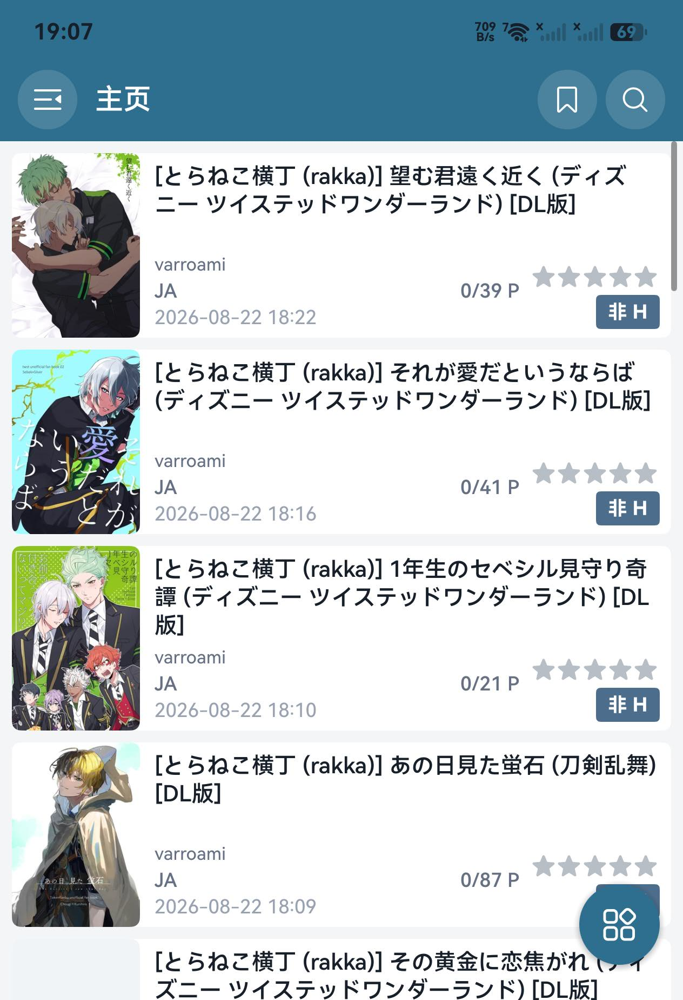
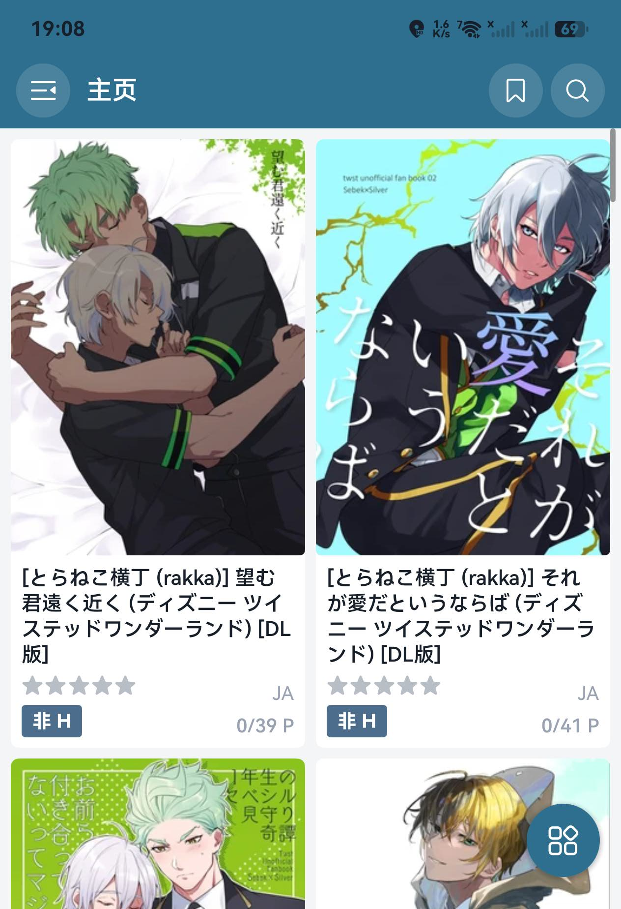
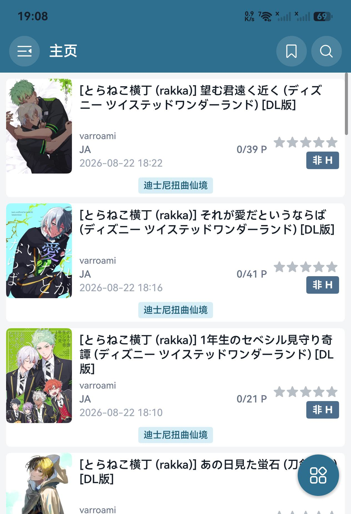
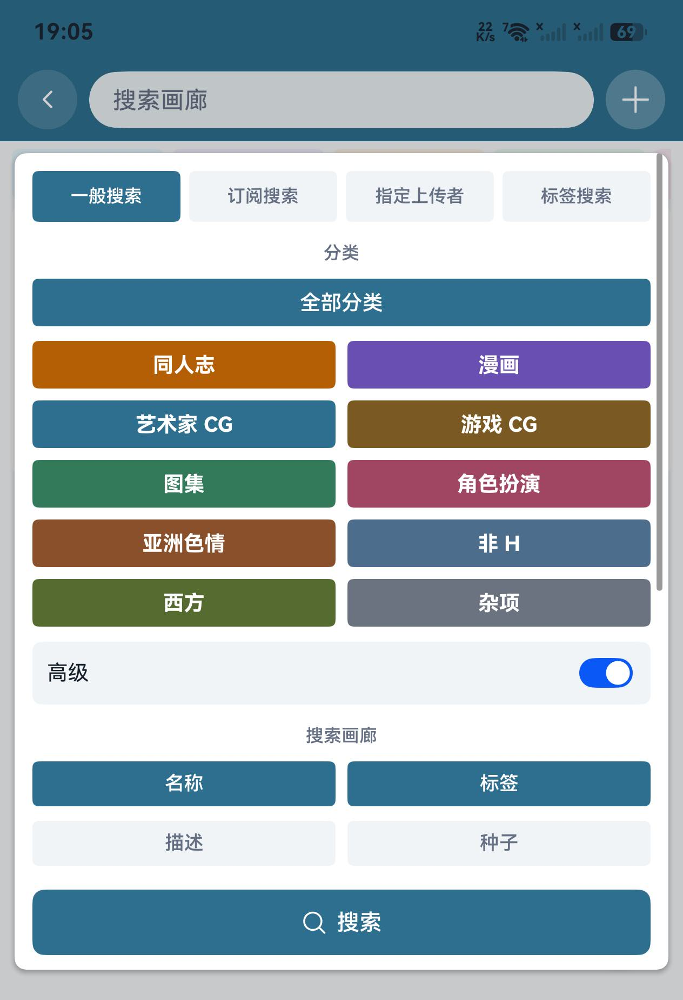
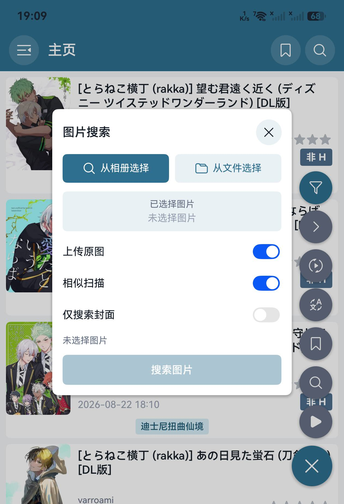
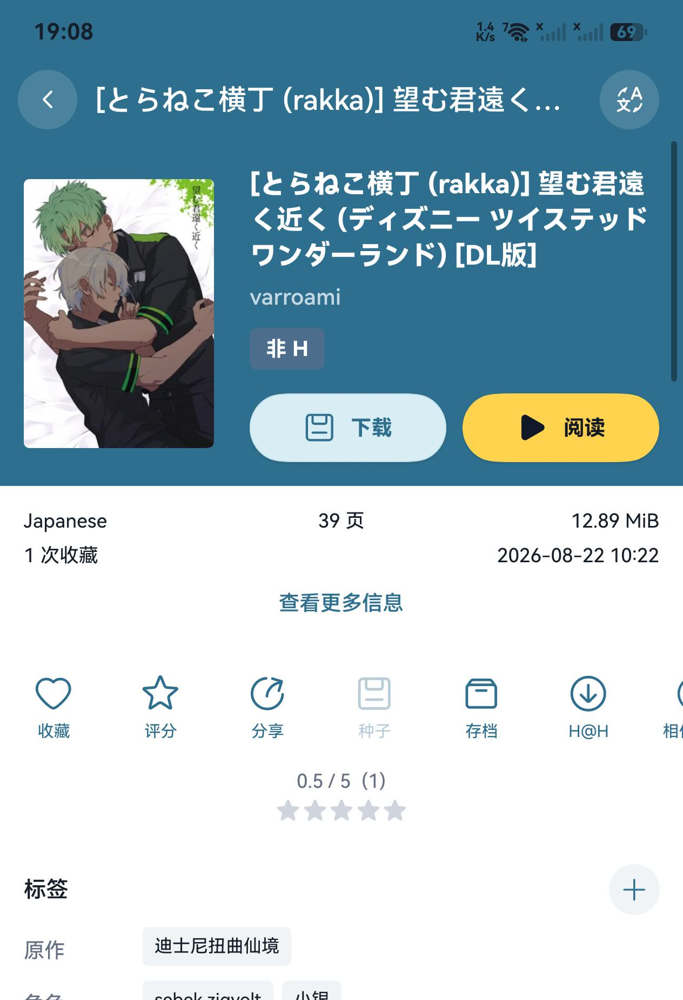
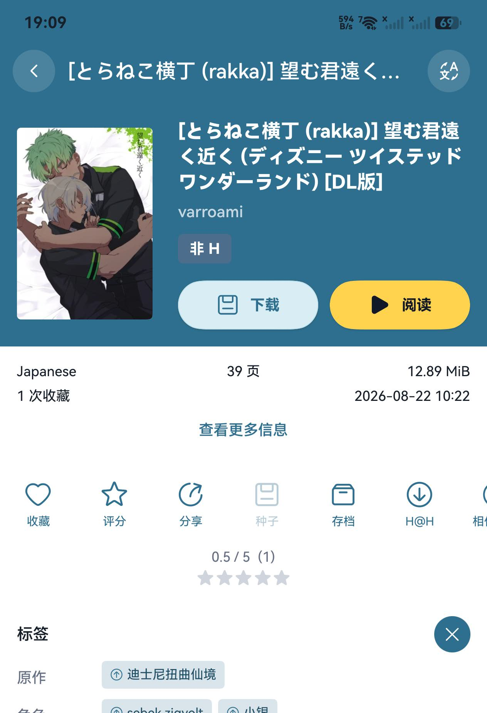
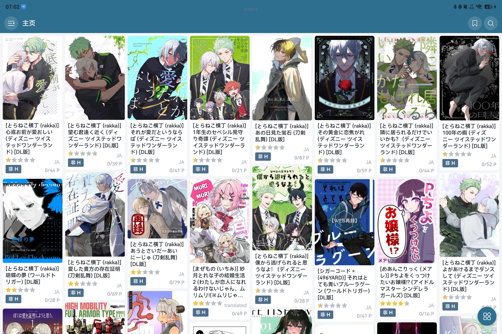

# EhViewer HarmonyOS

English · [简体中文](README.md)

  

EhViewer HarmonyOS is a HarmonyOS port of [Ehviewer_CN_SXJ](https://github.com/xiaojieonly/Ehviewer_CN_SXJ). It provides gallery browsing, search, reading, downloads, translation, and data migration on phones, tablets, foldables, and PCs.

## Download and installation

Download the latest unsigned HAP from [GitHub Releases](https://github.com/suibianqwe/Ehviewer_OHOS/releases). It can be installed with tools such as [Auto Installer](https://github.com/likuai2010/auto-installer).

- Current version: `0.6.3`
- Package: [`EhViewer_OHOS_0.6.3.hap`](https://github.com/suibianqwe/Ehviewer_OHOS/releases/download/v0.6.3/EhViewer_OHOS_0.6.3.hap)
- Target API: `26.0.0`
- Compatible API: `6.0.0(20)`

Devices running API 20 or later can install the app. SNI fronting enhancements are automatically skipped below API 23.

## User guide

See the [complete English user guide](docs/USER_GUIDE_EN.md) for first launch, login, search, split view, the reader, manga translation, downloads, network settings, and migration. A [Simplified Chinese guide](docs/USER_GUIDE.md) is also available.

> If covers or reader images do not load, first open `Settings → EH → Account configuration`, wait for the page to load, and return to the app so it can refresh the current site's account configuration. Then retry the failed image.

## Highlights

- Browsing: E-Hentai/ExHentai, home, subscriptions, popular, toplists, cloud/local favorites, history, and downloads.
- Search: keywords, multiple tags, uploaders, advanced filters, saved searches, search history, similarity search, and cover search.
- Gallery details: favorites, rating, system sharing, Torrent magnet links, archives, H@H, comments, previews, similar galleries, and tag editing/voting.
- Reader: horizontal/continuous reading, presets, gestures, rotation, adaptive two-page mode, border cropping, preloading, and an independent full-screen reader.
- Image processing: adjustments, adaptive moiré removal, system/API 26 Core Vision AI upscaling, and SDR-to-HDR. Pre-rendering uses `moiré removal and adjustments → upscaling → HDR`.
- Translation: titles, details, comments, and OCR manga translation through web services, DeepSeek, OpenAI, Gemini, or a custom compatible API.
- Downloads: a cross-gallery shared worker pool, progress/speed notifications, privacy notifications, status filters, multi-select actions, item recovery, and ZIP import/export.
- Wide screens: resizable split panes with independent routes and focus-aware Back behavior.
- Migration: JSON/Android database import, legacy EhViewer download recovery, and selectable Wi-Fi Direct transfer of reading progress, app settings, login cookies, bookmarks, favorites, blocklists, download metadata, and images. Local `igneous` is never exported or overwritten by incoming data.
- Personalization and network: multiple languages/themes, translated tags, filters, privacy controls, HTTP/SOCKS5 proxy, DoH, hosts, SNI fronting, direct-connect detection, and diagnostics.

## Screenshots

Portrait screenshots below come from a phone; landscape screenshots come from a tablet. The reader example follows `Subscriptions → Gallery details → Read`.

<table>
  <tr>
    <td></td>
    <td></td>
    <td></td>
    <td></td>
  </tr>
  <tr>
    <td align="center">Details</td>
    <td align="center">Thumbnails</td>
    <td align="center">Extended</td>
    <td align="center">Advanced search</td>
  </tr>
  <tr>
    <td></td>
    <td></td>
    <td></td>
    <td></td>
  </tr>
  <tr>
    <td align="center">Image search</td>
    <td align="center">Detail actions</td>
    <td align="center">Tag voting</td>
    <td align="center">Tablet gallery list</td>
  </tr>
</table>

<table>
  <tr>
    <td></td>
    <td></td>
    <td></td>
  </tr>
  <tr>
    <td align="center">Phone subscriptions</td>
    <td align="center">Reader layout</td>
    <td align="center">Tablet split view</td>
  </tr>
</table>

## Migrating downloads

Copy each gallery folder from the legacy Android EhViewer download directory into the HarmonyOS EhViewer download directory, then run `Settings → Downloads → Recover download items`. The app can also recognize unencrypted site archives, exported app packages, and supported gallery ZIP files in the public Download root.

See the [migration chapter](docs/USER_GUIDE_EN.md#14-migrating-downloads-from-the-original-ehviewer) for paths and screenshots.

## Feedback

Report problems through [Issues](https://github.com/suibianqwe/Ehviewer_OHOS/issues). Include the app version, device and OS version, reproduction steps, screenshots or a recording, and sanitized logs. For manga translation issues, also export OCR debug information when possible.

Never publish cookies, API keys, or other private information in logs.

## Credits and license

Thanks to the authors and contributors of [Ehviewer_CN_SXJ](https://github.com/xiaojieonly/Ehviewer_CN_SXJ), [EhViewer](https://github.com/seven332/EhViewer), and [EhTagTranslation/Database](https://github.com/EhTagTranslation/Database).

This project inherits the original application's license. See [LICENSE](LICENSE).
