# EhViewer HarmonyOS 完整使用教程

[English](USER_GUIDE_EN.md) · 简体中文

本教程适用于 EhViewer HarmonyOS `0.6.2`。不同设备的系统版本、窗口尺寸和权限状态可能让按钮位置略有差异，但功能入口和操作逻辑相同。竖屏截图来自手机，横屏截图来自平板；教程中的阅读器均从 `订阅 → 画廊详情 → 阅读` 进入。

> 提示：应用默认遵循系统代理和系统语言。网络正常时不需要开启 Hosts、SNI 域名前置或 DoH 等高级网络功能。

## 目录

1. [安装与首次启动](#1-安装与首次启动)
2. [登录与站点选择](#2-登录与站点选择)
3. [认识主界面](#3-认识主界面)
4. [浏览、列表模式与分栏](#4-浏览列表模式与分栏)
5. [搜索画廊](#5-搜索画廊)
6. [画廊详情与常用操作](#6-画廊详情与常用操作)
7. [阅读器](#7-阅读器)
8. [标题、评论与漫画翻译](#8-标题评论与漫画翻译)
9. [下载与本地阅读](#9-下载与本地阅读)
10. [收藏、历史、标签与评论黑名单](#10-收藏历史标签与评论黑名单)
11. [外观、语言与隐私](#11-外观语言与隐私)
12. [网络与代理](#12-网络与代理)
13. [备份、恢复与 Wi-Fi 直连传输](#13-备份恢复与-wi-fi-直连传输)
14. [从原 EhViewer 迁移下载数据](#14-从原-ehviewer-迁移下载数据)
15. [更新、日志与故障排查](#15-更新日志与故障排查)

## 1. 安装与首次启动

### 1.1 下载应用

1. 打开项目的 [GitHub Releases](https://github.com/suibianqwe/Ehviewer_OHOS/releases)。
2. 下载最新的 `EhViewer_OHOS_版本号.hap`。
3. 安装包为未签名 HAP，可使用 [小白调试助手](https://github.com/likuai2010/auto-installer) 等工具安装。

当前项目目标 API 为 `26.0.0`，兼容 API 为 `6.0.0(20)`。低于 API 23 的设备可以安装，但应用会自动跳过不兼容的 SNI 域名前置增强。

### 1.2 首次启动建议

首次进入应用后，建议依次完成：

1. 阅读并确认应用提示。
2. 在侧边菜单进入 `设置 → EH`，选择使用 `E-Hentai` 还是 `ExHentai`。
3. 需要收藏、订阅、My Tags 或 ExHentai 时完成登录。
4. 在 `设置 → 下载` 中选择下载位置、并行数和预加载数量。
5. 根据需要在 `设置 → 翻译` 中启用标题翻译或漫画翻译。

## 2. 登录与站点选择

### 2.1 选择站点

进入 `设置 → EH → 画廊站点`：

- `E-Hentai`：公开站点，适合普通浏览。
- `ExHentai`：需要有效账号 Cookie 和站点访问权限。

站点选择会影响主页、搜索、收藏、详情请求和恢复下载项时的元数据抓取。选择 E-Hentai 后，如果恢复元数据失败且账号已登录，应用会尝试回退到 ExHentai。

### 2.2 登录方式

应用提供应用内登录、网页登录和 Cookie 登录。退出登录或清除 Cookie 时会二次确认。

- 应用内登录：输入账号密码后会在 ArkWeb 中完成登录；如果出现 Cloudflare/Turnstile 验证，请在可见页面中手动完成验证，应用随后回收身份 Cookie。
- 网页登录：在登录页面完成网站验证后，由应用读取身份 Cookie。验证页循环时不要反复刷新，先等待验证完成并自动跳转。
- Cookie 登录：可分别填写 `ipb_member_id`、`ipb_pass_hash`、`igneous`，也可以在完整 Cookie 输入框中粘贴后自动识别。

如果退出后网页仍保持登录，请先使用应用内“退出登录/清除 Cookie”，再重新打开网页登录页面。

  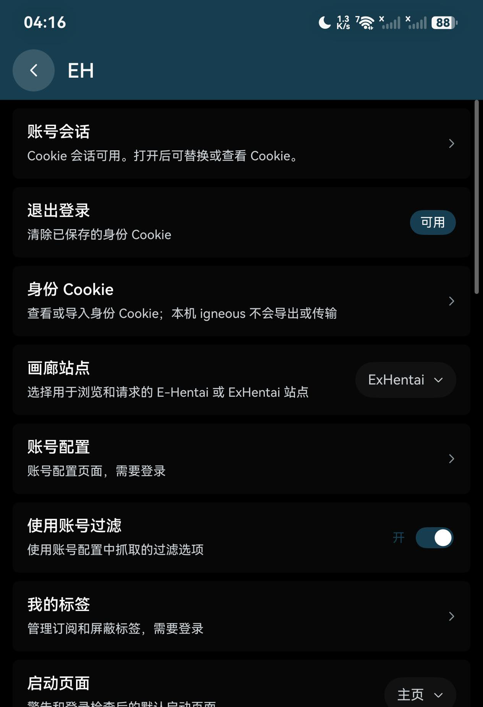
  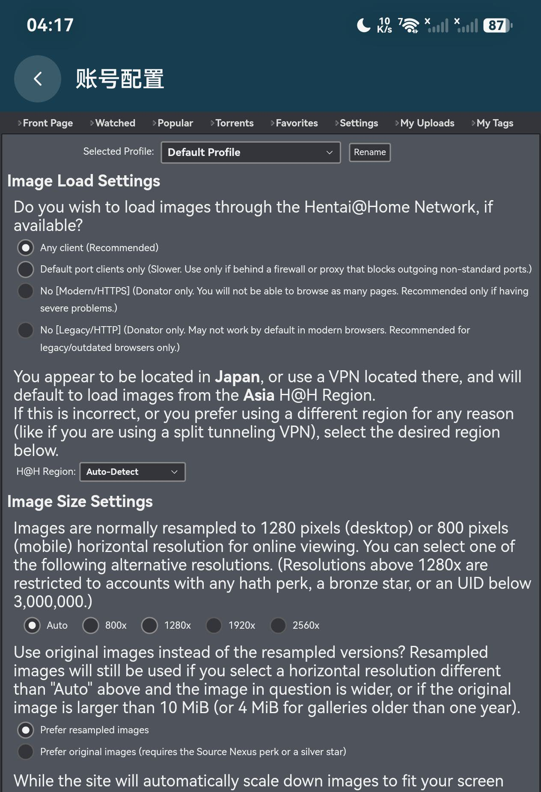

### 2.3 登录后获取账号配置

登录成功后，应用会尝试自动打开当前 E-Hentai/ExHentai 站点的账号配置并回收 `uconfig`。如果画廊封面、阅读器图片或配额仍无法加载，请优先手动执行一次：

1. 进入 `设置 → EH → 账号配置`。
2. 等待网页主体显示后直接返回应用；通常不需要点击网页中的 Apply。
3. 回到原页面下拉刷新，或点击失败图片重试。

这一步会重新获取图片加载区域、尺寸和过滤等账号配置。切换站点或重新登录后，如果图片加载异常，也建议先执行一次。账号 Cookie 会保存在本机；本机 `igneous` 不会通过备份或直连传给其他设备。

## 3. 认识主界面

主界面由标题栏、画廊列表、右下角工具栏和侧边菜单组成。

  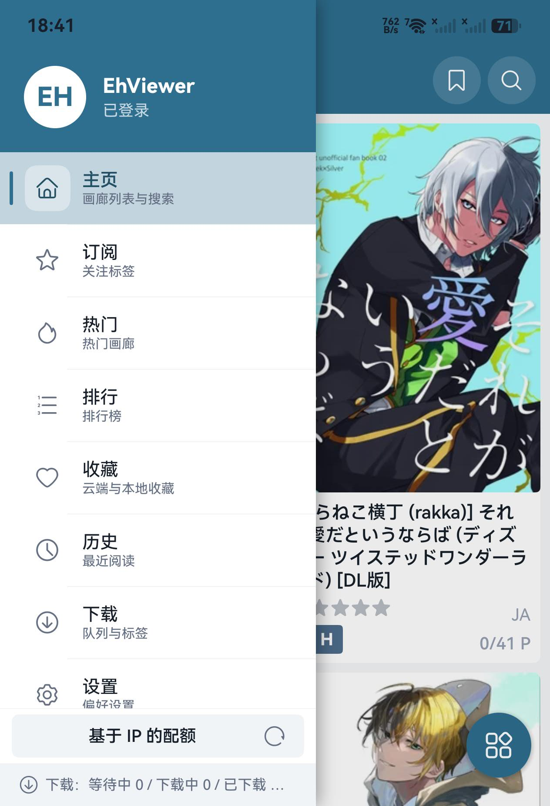

侧边菜单可进入主页、订阅、热门、排行、收藏、历史、下载和设置。右下角工具栏会根据页面显示布局、筛选、刷新、翻译或状态过滤等操作。

  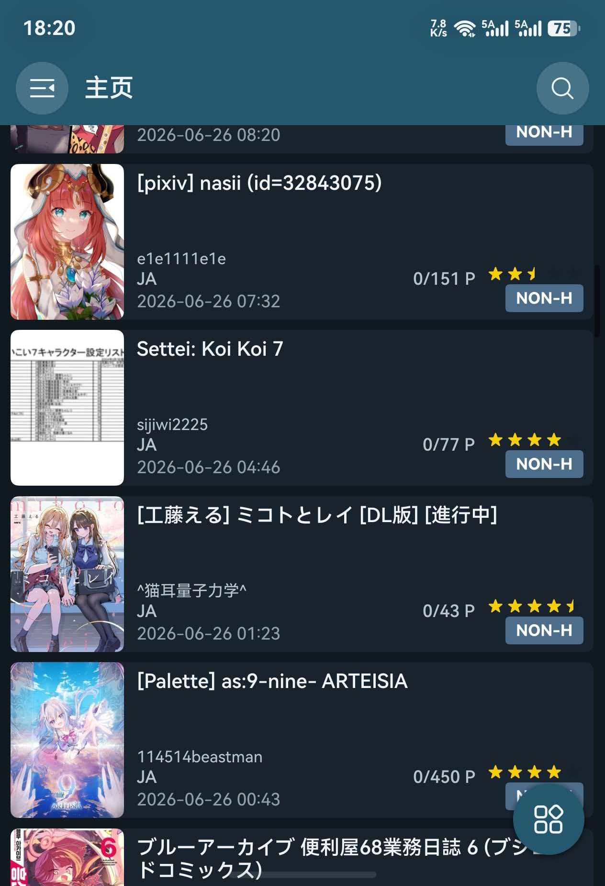
  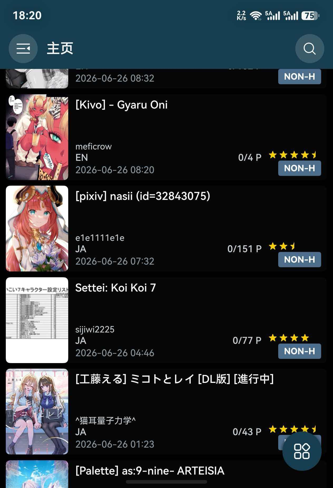

订阅页展示账号关注标签匹配的画廊，也是本教程进入阅读器的起点。

  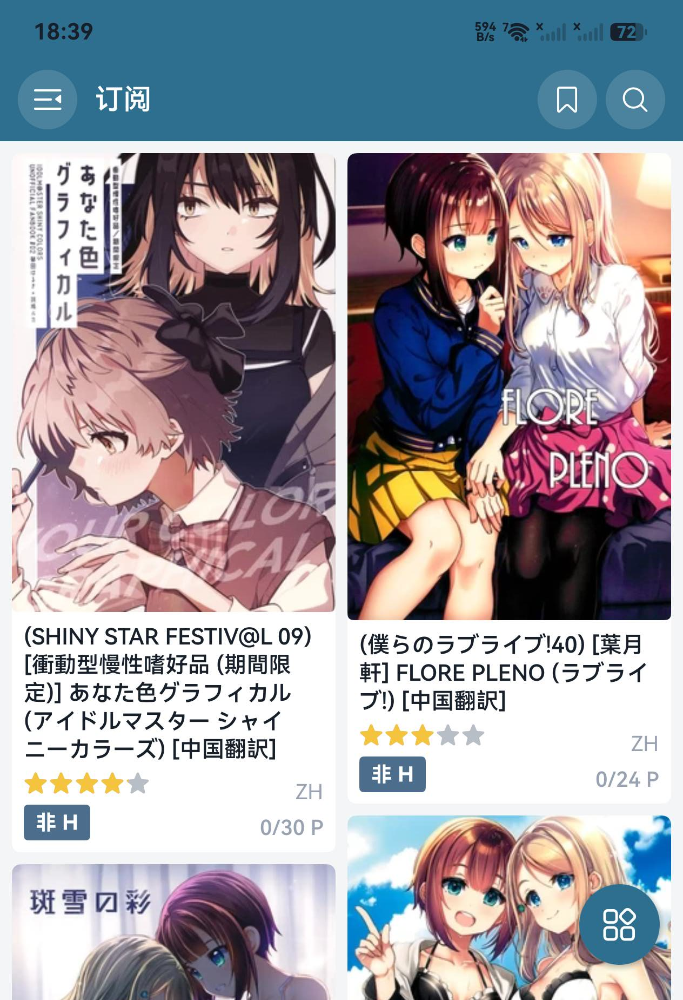

列表通常支持：

- 点击卡片：打开画廊详情。
- 长按卡片：打开该页面支持的快捷操作，例如收藏、下载、分享、删除历史或多选。
- 下拉刷新：重新请求当前页面。
- 滑动到底部：继续加载下一页。

## 4. 浏览、列表模式与分栏

### 4.1 列表模式

进入 `设置 → EH → 列表模式`，可选择：

- 详情：显示封面、标题、上传者、语言、页数、评分和分类。
- 缩略图：等宽瀑布流，图片高度按原图自适应；可单独控制评分和语言显示。
- 扩展：在详情卡片下方增加一行可横向滑动的标签。

详情和扩展模式使用“详情大小”；缩略图模式使用“缩略图大小”。标签、语言和分类的中文显示由“显示标签翻译”控制。

  

### 4.2 宽屏分栏

在平板、折叠屏展开态和电脑窗口中，可通过 `设置 → EH → 分栏模式` 启用左右分栏。

  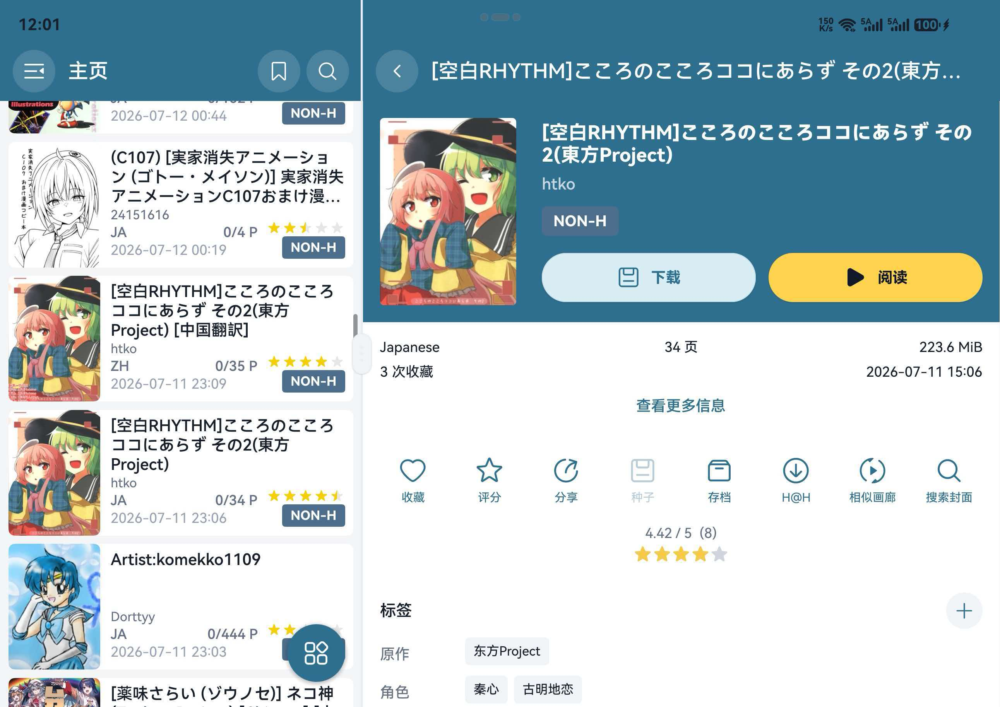

  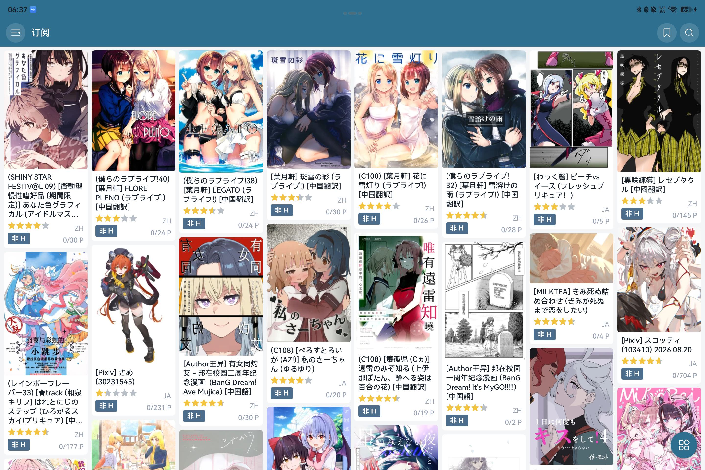
  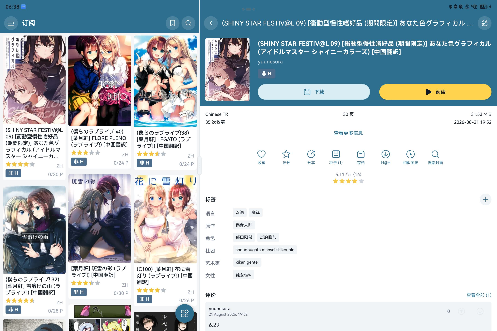

- 左栏保留列表或上级页面，右栏显示详情或次级页面。
- 拖动中间分割线可调整宽度，位置会在支持分栏的页面间共享。
- 点击左栏卡片后，系统返回优先控制获得焦点的右栏；继续在左栏操作后，焦点会回到左栏。
- 有右栏的页面之间切换使用淡入淡出，普通打开或关闭右栏使用侧向动画。
- 阅读器始终独立全屏，不参与分栏。

## 5. 搜索画廊

点击标题栏搜索按钮进入搜索页。搜索页支持普通关键词、上传者、标签、订阅和高级筛选。

### 5.1 关键词与多标签搜索

输入关键词后提交即可搜索。点击详情页标签时，会打开完整搜索页并生成可移除的标签条件；可以继续添加多个标签。

  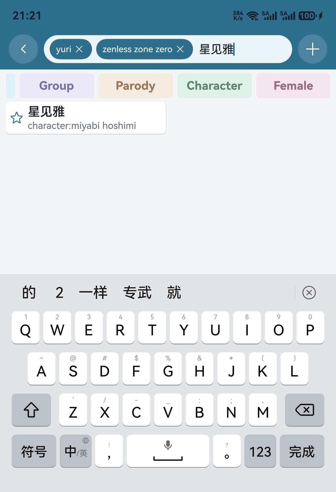

- 点击标签：加入搜索条件。
- 点击已选标签上的删除按钮：移除该条件。
- 点击上传者：按上传者进入新的下一级搜索。
- 返回：逐层恢复上一级搜索条件、列表位置和详情状态。

### 5.2 高级搜索

点击搜索栏旁的高级按钮，可设置分类、搜索范围和高级条件。

  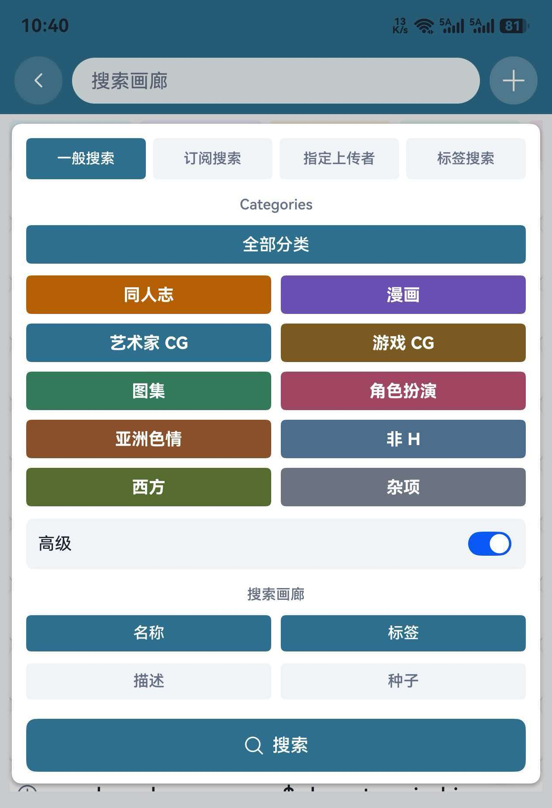

常用选项包括画廊分类、名称/标签/描述/种子范围以及订阅、上传者、标签等搜索模式。搜索条件可以保存为搜索书签，之后从搜索书签栏快速恢复。

### 5.3 图片搜索

图片搜索可从相册或文件中选择图片，再选择相似图片搜索或封面搜索。

  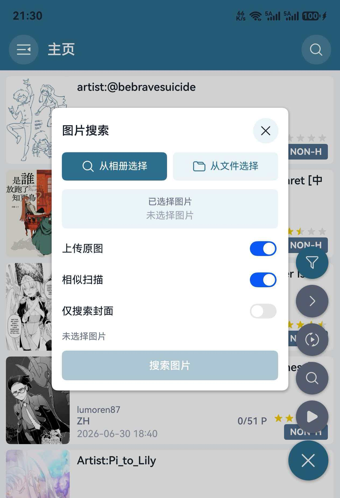

详情页“相似画廊”和“搜索封面”会复用相同的搜索页面与路由状态。

## 6. 画廊详情与常用操作

详情页包含封面、标题、上传者、分类、页数、大小、时间、评分、标签、评论和预览图。

  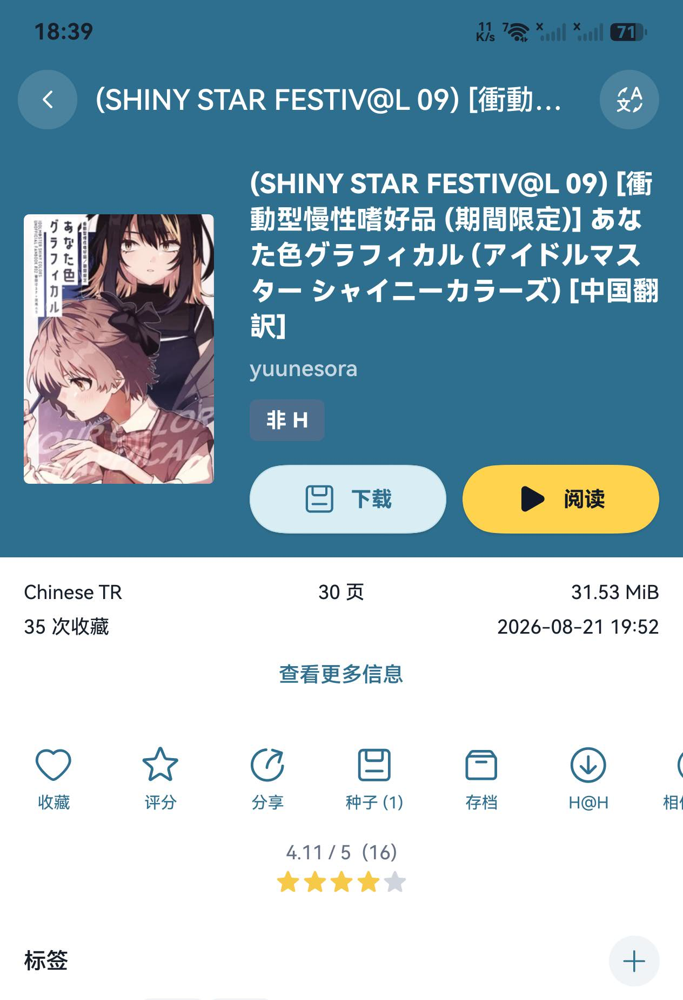
  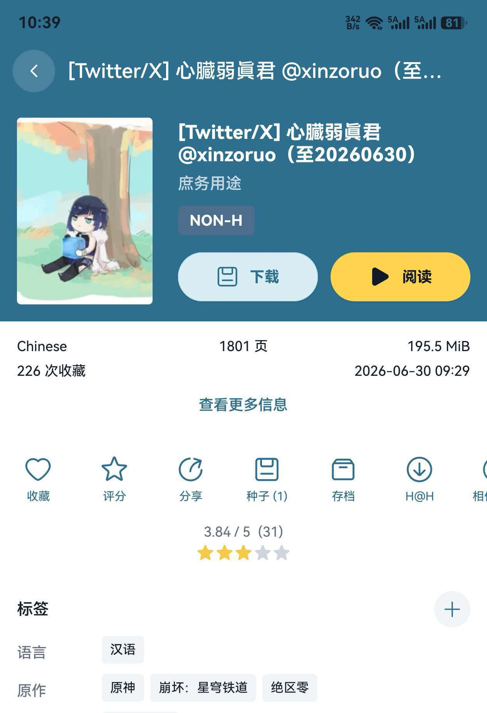

常用操作：

- 收藏：选择云端收藏夹或本地收藏夹。
- 评分：点击星级提交评分。
- 分享：调用 HarmonyOS 系统分享面板。
- 种子：在中央弹窗查看 Torrent，点击种子可复制磁力链接。
- 存档：选择原图或压缩图存档并下载到公共 Download 根目录；完成通知可打开文件位置。
- H@H：请求 H@H 下载并保存到公共 Download 根目录。
- 相似画廊/搜索封面：打开对应搜索结果。
- 下载：加入下载队列。
- 阅读：立即进入全屏阅读器。

### 6.1 标签操作

点击标签可进入对应搜索。点击标签区域的添加按钮可进入编辑和投票模式。

  

标签名称、标签类别和搜索联想是否显示中文，由 `设置 → EH → 显示标签翻译` 统一控制，与系统语言无关。

## 7. 阅读器

阅读器始终全屏。点击画面中央显示或隐藏控制层，左右区域用于翻页；双击可快速缩放，双指可缩放，长按图片打开图片操作菜单。

  
  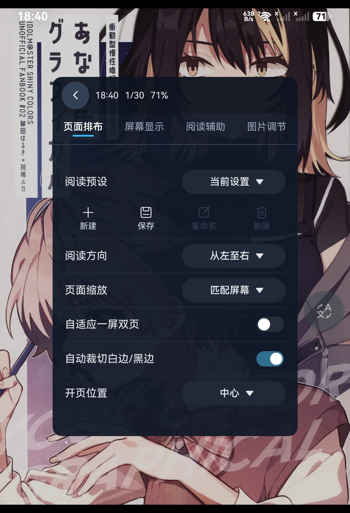

### 7.1 阅读方向与缩放

可在阅读器选项浮窗或 `设置 → 阅读` 中调整：

- 阅读方向：从左到右、从右到左、从上到下。
- 页面缩放：原始大小、适应宽度、适应高度、匹配屏幕或固定比例，具体选项随阅读方向变化。
- 屏幕旋转：默认、纵向、横向、自动旋转或匹配图片。
- “屏幕显示”页签：屏幕旋转、图片超分、SDR 转 HDR、阅读全屏、保持屏幕常亮、自定义亮度和超暗模式。
- “阅读辅助”页签：自动翻页、音量键翻页、翻译开关、时钟、进度和电量显示。
- 音量键翻页和自动翻页间隔。

  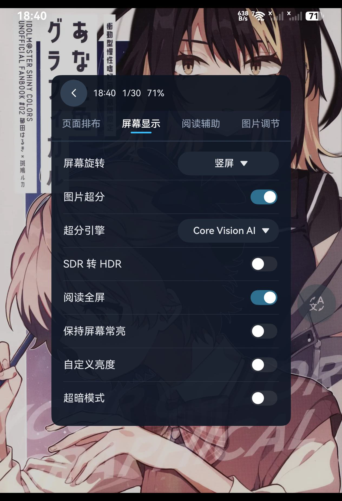

### 7.2 自适应一屏双页

开启后，纵屏观看横向宽图时，如果屏幕可以合理容纳相邻两页，会将两页上下组合；横屏观看窄图时则左右组合。

启用一屏双页后：

- 阅读方向只能选择左右翻页。
- 页面缩放固定为匹配屏幕。
- “屏幕旋转匹配图片”不可用。

### 7.3 图片预加载

`设置 → 下载 → 多线程下载` 同时控制阅读器图片和下载队列的总并行数；`预加载图片` 控制阅读器提前加载的后续页数。阅读器当前页优先级最高，不会被后台画廊下载长期阻塞。

### 7.4 阅读预设

在阅读器选项的“页面布局”页签中选择“阅读预设”，可以快速切换一组阅读参数：

- “当前设置”始终表示尚未保存为预设的当前组合。
- 可在阅读器内新建预设，并保存当前阅读方向、缩放、旋转、双页和图像处理等设置。
- 自定义预设可以更新、重命名或删除；预设名称不能重复，也不能使用“当前设置”。
- 内置预设不能重命名或删除，但可以更新其设置内容。

切换预设会立即应用，不需要退出阅读器。适合为条漫、横版漫画、普通竖版漫画或大屏设备分别保存配置。

### 7.5 图片增强与白边裁切

阅读器选项的“图片调节”“屏幕显示”和“页面布局”页签提供以下图像处理功能：

- 去除摩尔纹：可选关、自动、弱、中、强；自动模式会根据图源尺寸与目标物理显示尺寸决定是否处理。
- 图像调节：可调曝光、亮度、对比度、亮部、暗部、清晰度、锐化等参数。
- 图片超分：将低分辨率图片提升到适合当前显示区域的目标尺寸。API 26 设备可选择 Core Vision AI 引擎，其他环境使用系统图像超分能力。
- SDR 转 HDR：在支持的设备和图片上增强高光、亮度与色彩表现。
- 去摩尔纹、图像调节、超分与 HDR 可以组合；处理顺序固定为“去摩尔纹及图像调节 → 超分 → HDR”，结果会在预渲染范围内提前生成。
- 长图超过接口尺寸限制时会分段超分，再组合用于显示。
- 自动裁切白边/黑边：在预渲染阶段识别图片外围近似纯色区域，减少无效边缘占用，不修改原始文件。

图像增强依赖设备能力，无法处理的格式或设备不支持时会保留原图。长按保存图片时，优先保存当前实际显示的图像调节、去摩尔纹、超分或 HDR 处理结果。

  

### 7.6 缩放与硬件控制

- 双击图片：较小时放大到适应屏幕；已适应屏幕时继续放大；达到较大倍率后双击恢复到适应屏幕。
- 双指缩放：连续调整图片倍率和查看位置。
- 键盘方向键、翻页键、鼠标滚轮及支持的硬件按键可直接翻页，无需额外开关。
- “保持屏幕常亮”位于阅读器选项的“屏幕显示”页签，仅在阅读期间阻止系统休眠，退出阅读器后恢复应用原有窗口状态。

## 8. 标题、评论与漫画翻译

### 8.1 开启翻译入口

进入 `设置 → 翻译`：

1. 开启“翻译功能”，列表、详情和评论页会显示翻译按钮。
2. 开启“漫画翻译”，阅读器内会显示半透明贴边翻译按钮。
3. 选择目标语言和翻译服务。

列表翻译会优先处理当前屏幕内容，再处理屏幕外上下少量项目。滑动后，新进入翻译区的内容才会加入请求。

### 8.2 机翻与 AI 翻译

- 关闭“AI 翻译”时，可选 Google、必应、百度、有道、MyMemory 或 Lingva 网页服务。
- 开启“AI 翻译”时，可选 DeepSeek、OpenAI、Gemini 或自定义 OpenAI 兼容 API。
- 自定义 API 可保存多套名称、地址、密钥和模型；模型既可在线获取，也可手动输入。
- “合并翻译请求”可减少网页服务请求频率；AI 每批最多合并 5 条，不降低原有并发。
- AI 翻译支持思考模式、系统提示词预设/自定义和对话记录导出。关闭记录时会清空已有记录。

### 8.3 漫画 OCR 翻译

在阅读器中点击悬浮翻译按钮可显示或隐藏当前画廊译文；长按按钮会重新 OCR 并重新翻译当前页。

- 处理优先级为当前页、下一页、下下页。
- OCR 会估算横排/竖排、字号和文本框位置，并合并属于同一文本框的行列。
- 译文位置相对图片保存，切换阅读方向、旋转或打开选项浮窗不会改变相对布局。
- 已下载画廊的结果保存到下载元数据；在线阅读结果保存到历史数据。
- 退出阅读器会取消该阅读器尚未开始及可中断的 OCR/翻译任务。

出现识别或定位问题时，可开启“记录漫画 OCR 调试信息”，复现后导出日志；关闭记录会清空已有 OCR 调试记录。

## 9. 下载与本地阅读

点击详情页“下载”或卡片长按菜单中的下载操作，即可加入下载队列。

### 9.1 下载设置

进入 `设置 → 下载`：

- 下载位置：应用文件目录或公共 Downloads 目录。
- 多线程下载：统一控制阅读器与下载页图片任务并行数；线程池按全部画廊计算，当前画廊剩余图片不足时会继续处理下一个等待画廊。
- 预加载图片：控制阅读器提前加载的后续图片数量。
- 图片分辨率/下载原图：控制请求的页面规格。
- 下载超时、文件顺序和大列表分页。

### 9.2 下载页操作

  

- 点击任务：打开本地详情或继续处理任务。
- 长按卡片：进入多选模式。
- 删除：会显示待删除数量并二次确认。
- 右下角状态按钮：多选要显示的等待、下载中、已完成、失败等状态。
- 导出压缩包：保存到公共 Download 根目录。

通知栏优先显示“下载中/下载完成/下载失败”等状态，并显示进度和速度。启用隐私模式后不显示具体画廊或文件信息。

### 9.3 恢复下载项

进入 `设置 → 下载 → 恢复下载项`。应用会扫描画廊下载目录和公共 Download 根目录中的未加密 ZIP：

- 应用导出的压缩包：解压到画廊目录并恢复元数据。
- 原 EhViewer 画廊压缩包：识别内部结构后解压并调用现有恢复逻辑。
- 网站存档 ZIP：从文件名中的画廊 ID 抓取元数据，新建正确目录后解压。
- 无法识别、无法抓取元数据或加密的压缩包：跳过且不改动。

处理完成后会显示恢复、处理和跳过数量，并可选择是否删除已处理的压缩包。

## 10. 收藏、历史、标签与评论黑名单

### 10.1 收藏

收藏页同时支持云端收藏和本地收藏。长按收藏卡片可执行快捷操作，包括移除收藏。收藏数据可随应用数据导入/导出。

### 10.2 历史

浏览详情会写入历史；阅读进度和在线漫画翻译结果也会随历史保存。可在 `设置 → EH → 历史记录数量` 控制保存上限，历史页长按可删除记录。

### 10.3 My Tags 与本地过滤

- `设置 → EH → My Tags`：管理订阅和屏蔽标签，需要登录。
- `设置 → EH → 过滤`：配置标签、上传者、关键词和评分过滤规则。
- 标签搜索联想、过滤页、My Tags 和详情页标签的显示语言统一受“显示标签翻译”控制。

### 10.4 评论黑名单

进入 `设置 → EH → 评论黑名单`，可按完整用户名屏蔽指定用户发表的画廊评论：

- 在管理页输入用户名，可选填屏蔽原因，然后点击添加按钮。
- 在画廊的完整评论页点击评论行右侧的屏蔽按钮，可直接将该评论者加入黑名单；添加后当前评论会立即隐藏。
- 黑名单只影响本机评论显示，不会修改网站账号的评论设置，也不会屏蔽该用户上传的画廊。
- 在黑名单管理页点击删除按钮并确认，可恢复显示该用户的评论。

本应用 JSON 备份、原安卓应用数据库导入和 Wi-Fi 直连传输都支持评论黑名单。导入时按用户名合并，已有条目不会重复添加。

## 11. 外观、语言与隐私

### 11.1 外观

`设置 → EH` 支持浅色、深色、黑色主题，也可跟随系统深色模式。主题色包含蓝色、天蓝色、青色、绿色、紫色、橙色和玫红色；标题栏及启动过渡背景会跟随主题色。

### 11.2 语言

进入 `设置 → 高级 → 应用语言`，可选择跟随系统、英文、简体中文或繁体中文。

“显示标签翻译”独立于应用语言：关闭后标签、分类和标签类别使用站点原文；开启后在数据库有内容时显示中文。

### 11.3 隐私

进入 `设置 → 隐私`：

- 身份验证：应用从后台返回时验证身份。
- 隐私模式：防止截屏和不安全的任务预览，同时隐藏下载通知中的具体文件信息。
- 保存解析错误正文/崩溃日志：仅在排查问题时开启，导出完成后可关闭或清理。

## 12. 网络与代理

网络正常时保持默认即可。所有高级处理都有独立开关；关闭后请求不会经过对应功能。

### 12.1 代理

进入 `设置 → 高级 → 代理`：

- 系统：遵循 HarmonyOS 当前系统代理，默认选项。
- 直连/跳过系统代理：不使用系统代理。
- HTTP：填写服务器、端口和可选认证。
- SOCKS5：支持认证、排除列表和代理端 DNS；低 API 设备会禁用不兼容能力。

翻译请求只遵循代理设置，不使用 Hosts、SNI 前置、直连检测等 EH 专用网络增强。

### 12.2 DoH、Hosts 与 SNI 域名前置

- DoH：加密 DNS 查询，可选 Yandex、Cloudflare 或 Google；直连检测不会绕过 DoH，也不会改变 DoH 开关。
- 内置 Hosts：仅在普通 DNS 无法正确解析时开启。
- EX Hosts：仅在 ExHentai 相关域名需要覆盖时开启。
- SNI 域名前置：用于特定网络中的 SNI 阻断；测速和 IP 加权只在该功能开启时生效。
- 直连检测：在保留代理和 DoH 的情况下检测当前站点；成功时跳过 Hosts 与 SNI 前置，失败时才允许它们参与。

更改网络设置后可运行“网络诊断”，分别检查 E-Hentai、ExHentai、论坛和项目仓库。

## 13. 备份、恢复与 Wi-Fi 直连传输

### 13.1 文件备份

进入 `设置 → 高级`：

- 导出数据：将设置、历史、下载信息、收藏书签、过滤规则和评论黑名单保存为 JSON。
- 导入数据：读取本应用备份或支持的原安卓应用数据库；原应用 `Black_List` 数据会合并到评论黑名单。

导入前建议先导出当前数据作为备份。

### 13.2 Wi-Fi 直连传输

进入 `设置 → 高级 → Wi-Fi 直连传输`。两台附近设备分别选择发送端和接收端，按页面提示建立 Wi-Fi P2P 连接。

可选择以下数据：

- 阅读进度：在一次连接中双向合并两台设备的进度，以最近一次实际翻页的时间为准；时间相同时保留页码更大的记录。同步完成后两端进度一致，不需要交换发送端和接收端再次操作。
- 应用设置和登录 Cookie：同步可迁移的偏好和登录状态；设备路径、文件授权、缓存及其他设备相关状态不会覆盖接收端。
- 搜索书签、本地收藏和评论黑名单：从发送端合并到接收端。
- 下载记录和图片：传输下载元数据及已下载图片文件。

可以同时多选多个数据类别再开始发送。发送端创建 Wi-Fi 直连群组，接收端扫描并选择发送设备；建立群组后仍需等待应用数据通道连接完成。

  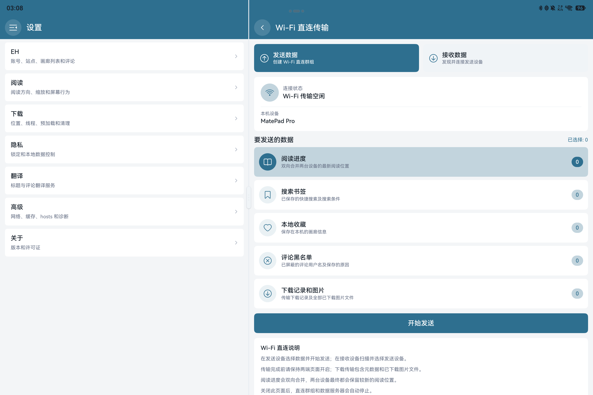
  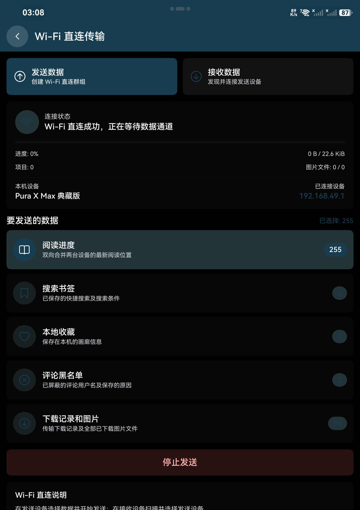

传输时保持两台设备页面开启，完成前不要主动断开 Wi-Fi 直连。阅读进度同步不传输漫画 OCR 翻译结果，因此即使历史记录较多也能保持较小的数据量。`igneous` 永远以接收设备本机值为准：不会由发送端导出，导入或接收数据时也不会采用传入值。

## 14. 从原 EhViewer 迁移下载数据

推荐先复制原应用画廊目录，再使用“恢复下载项”。

<table>
  <tr>
    <td></td>
    <td></td>
    <td></td>
  </tr>
  <tr>
    <td align="center">找到原下载目录</td>
    <td align="center">复制到 EhViewer 目录</td>
    <td align="center">运行恢复下载项</td>
  </tr>
</table>

1. 在文件管理器中找到原安卓应用的下载目录，通常为 `我的手机 → 兼容应用数据 → EhViewer → download`。
2. 将其中每个画廊文件夹复制到鸿蒙可访问的 `我的手机 → Download → EhViewer → EhViewer`。
3. 打开应用，进入 `设置 → 下载 → 恢复下载项`。
4. 等待应用识别目录、整理图片文件名并抓取缺失元数据。

如果只有 ZIP，可以把未加密压缩包放在公共 Download 根目录，再运行同一恢复功能。迁移画廊标题发生变化时，后续下载会整理目录和图片文件名，不会从第一页重复下载已有图片。

## 15. 更新、日志与故障排查

### 15.1 检查更新

进入 `设置 → 关于 → 检查更新`，或直接查看 [GitHub Releases](https://github.com/suibianqwe/Ehviewer_OHOS/releases)。标签翻译数据库可在“关于”页单独检查，应用会先比较版本，仅在存在新版本时下载。

### 15.2 常见问题

#### 画廊或图片无法加载

1. 先进入 `设置 → EH → 账号配置`，等待页面加载后直接返回，再重试图片或下拉刷新。
2. 确认浏览器能否访问当前选择的站点。
3. 检查代理设置是否正确。
4. 运行网络诊断。
5. 仅在需要时依次尝试 DoH、内置 Hosts 和 SNI 域名前置，不要同时盲目开启全部选项。
6. 点击失败图片可重新加载；冷启动网络尚未就绪时可稍后下拉刷新。

#### ExHentai 无法访问或配额无法加载

1. 确认站点选择为 ExHentai。
2. 打开 `设置 → EH → 账号配置`，等待加载后返回，让应用重新获取当前站点配置。
3. 重新登录并检查 `ipb_member_id`、`ipb_pass_hash`、`igneous`。
4. 运行网络诊断，确认主站请求是否正常。
5. 如果网络无法直连，再按需开启 Hosts/SNI 前置。

#### 翻译失败或超时

1. 在 `设置 → 翻译` 使用“测试翻译”。
2. 网页服务可能限流或返回 403，可更换服务或稍后重试。
3. AI 服务请检查 API 地址、密钥、模型和余额。
4. 关闭再开启页面翻译会重新请求；关闭翻译时，当前和排队请求会被取消。

#### 漫画译文识别或位置错误

长按阅读器翻译按钮重新识别当前页。如果仍可复现，开启 OCR 调试记录、重新翻译一次并导出记录，同时提供原图和显示截图。

### 15.3 导出问题信息

反馈问题时建议提供：

- 发生问题的页面和完整操作步骤。
- 应用版本、设备型号、系统版本和当前站点。
- 截图或录屏。
- `设置 → 高级 → 导出日志`生成的日志；漫画翻译问题另附 OCR 调试导出。

请勿公开包含账号 Cookie、API 密钥或其他隐私信息的日志。

---

[返回 README](../README.md) · [提交 Issue](https://github.com/suibianqwe/Ehviewer_OHOS/issues) · [查看 Releases](https://github.com/suibianqwe/Ehviewer_OHOS/releases)
